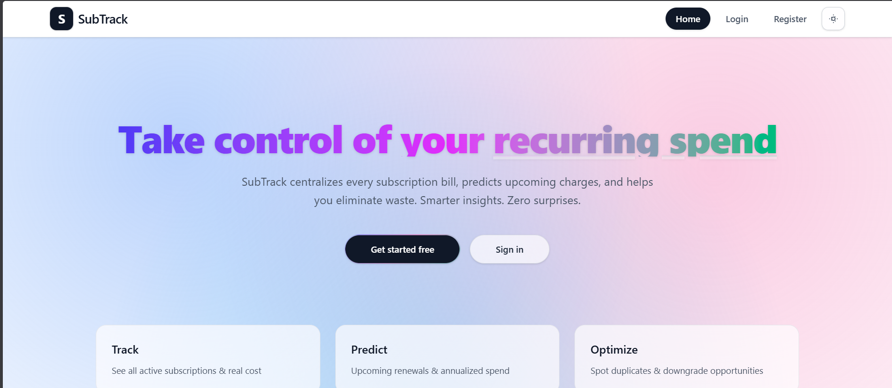
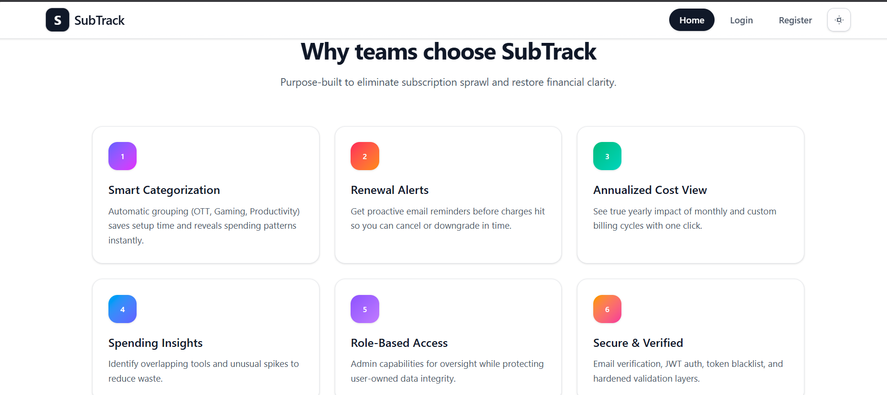
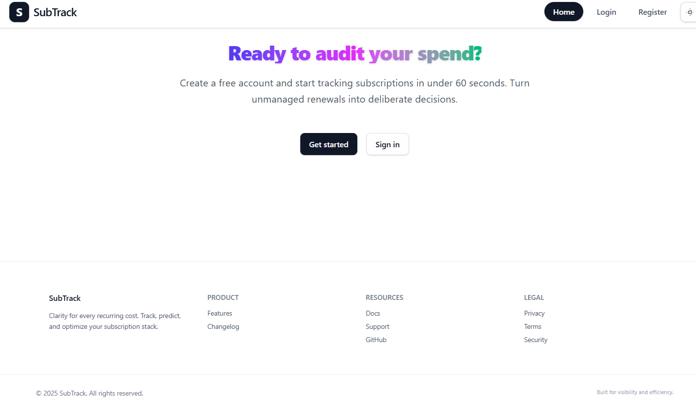
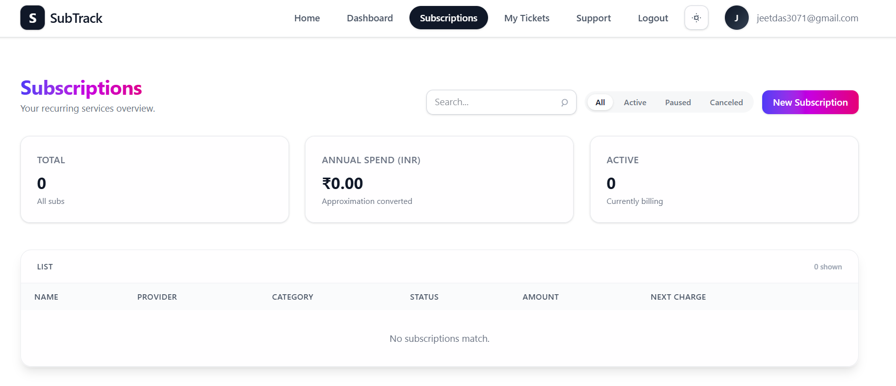
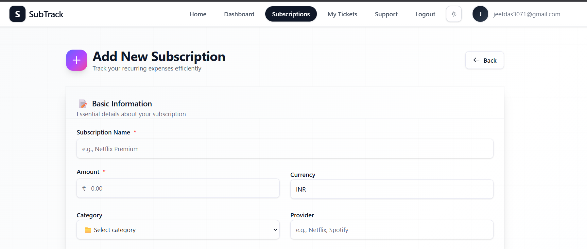
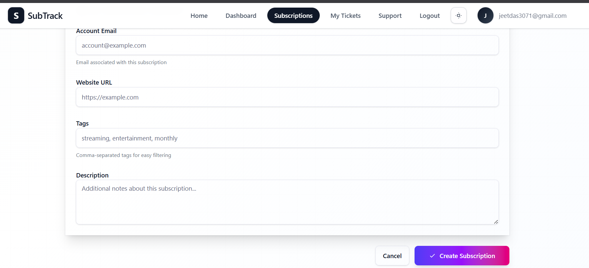
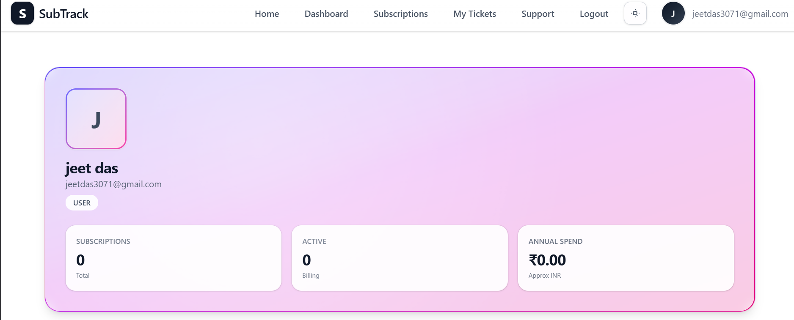
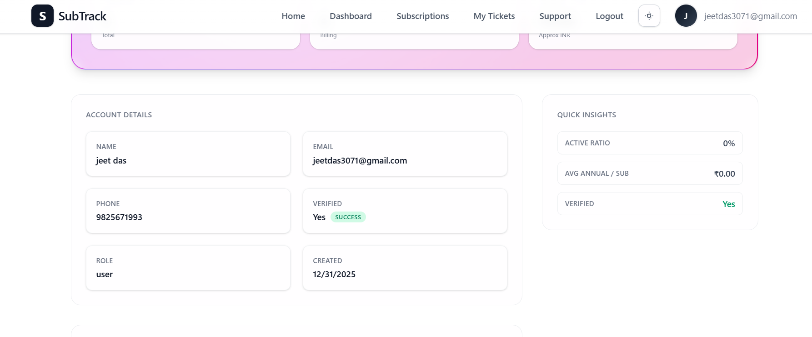
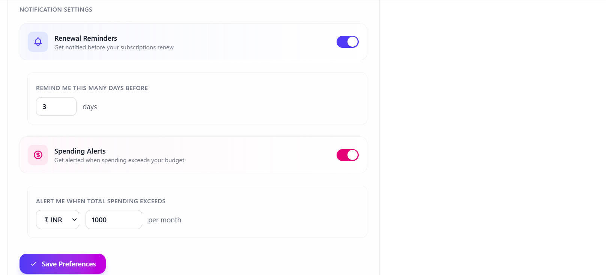
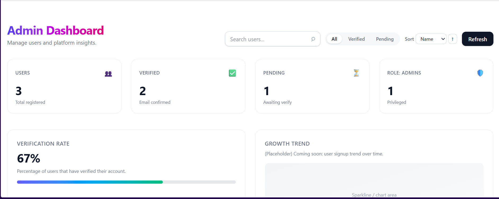

<div align="center">

# SubTrack — Subscription Management Platform

### A Full-Stack MERN Application for Personal Finance Management

[](https://thesubtrack.netlify.app)
[](https://github.com/kaustav3071/Subscription-tracker)


---

**A production-ready subscription tracking platform** that helps users monitor, analyze, and optimize their recurring expenses with real-time analytics, multi-currency support, and intelligent notifications.



</div>

---

## 📌 Project Overview

SubTrack is a comprehensive subscription management solution designed to address a common financial challenge: tracking multiple recurring payments across various services. Built as a solo project during a 48-hour hackathon, it demonstrates proficiency in full-stack development, modern UI/UX design, and production deployment practices.

### Key Achievements
- **Full-Stack Architecture**: Complete separation of concerns with RESTful API backend and React SPA frontend
- **Production Deployed**: Live on Netlify (frontend) and Render (backend) with MongoDB Atlas
- **Security-First Design**: JWT authentication, role-based access control, input sanitization, and rate limiting
- **Responsive Design**: Mobile-first approach with glassmorphism UI and dark mode support

---

## 🛠️ Technical Stack

### Frontend
| Technology | Purpose |
|------------|---------|
| **React 19** | UI library with hooks and context for state management |
| **Vite 7** | Build tool for fast development and optimized production builds |
| **React Router 7** | Client-side routing with protected routes |
| **TailwindCSS 4** | Utility-first CSS framework for responsive design |
| **Chart.js** | Data visualization for spending analytics |
| **Axios** | HTTP client with interceptors for auth handling |

### Backend
| Technology | Purpose |
|------------|---------|
| **Node.js 18+** | JavaScript runtime environment |
| **Express 5** | Web framework with async/await error handling |
| **MongoDB** | NoSQL database with Mongoose ODM |
| **JWT** | Stateless authentication with token blacklisting |
| **SendGrid** | Transactional email service for notifications |
| **Helmet.js** | Security headers middleware |

### DevOps & Deployment
| Service | Usage |
|---------|-------|
| **Netlify** | Frontend hosting with CI/CD |
| **Render** | Backend API hosting |
| **MongoDB Atlas** | Cloud database cluster |

---

## ✨ Features

### User Features

**🔐 Authentication & Authorization**
- Email verification flow with HTML templates
- JWT-based session management with secure logout (token blacklisting)
- Role-based access control (User/Admin)

**📊 Dashboard & Analytics**
- Real-time KPIs: Active subscriptions, monthly/annual spend
- Interactive charts (bar, doughnut) for spending breakdown
- Category-wise expense distribution
- Top 5 highest-cost subscriptions

**💳 Subscription Management**
- Full CRUD operations with intuitive forms
- Support for multiple billing cycles (daily, weekly, monthly, quarterly, yearly, custom)
- Status management: Active, Paused, Canceled
- Auto-categorization based on subscription name

**💰 Financial Intelligence**
- Multi-currency support with automatic INR conversion
- Annual cost normalization across billing cycles
- Spending threshold alerts
- Renewal reminders (configurable days before)

### Admin Features

**👥 User Management**
- View, update, and delete user accounts
- Role promotion/demotion (with self-demotion protection)
- View any user's subscription portfolio

**🎫 Support System**
- Ticket management with status tracking
- Email reply functionality via SendGrid
- Full conversation history

---

## 📸 Screenshots

<div align="center">

### Dashboard
<table>
<tr>
<td></td>
<td></td>
</tr>
</table>

### Subscription Management
<table>
<tr>
<td></td>
<td></td>
<td></td>
</tr>
</table>

### User Profile
<table>
<tr>
<td></td>
<td></td>
<td></td>
</tr>
</table>

### Admin Panel


</div>

---

## 🏗️ Architecture

```
┌─────────────────────────────────────────────────────────────────────────┐
│                              CLIENT (React SPA)                         │
│  ┌──────────────┐  ┌──────────────┐  ┌──────────────┐  ┌──────────────┐ │
│  │   Pages      │  │  Components  │  │   Context    │  │   Services   │ │
│  │  Dashboard   │  │   UI Kit     │  │  AuthContext │  │   API Layer  │ │
│  │  Profile     │  │   Charts     │  │              │  │   Axios      │ │
│  │  Admin*      │  │   Forms      │  │              │  │              │ │
│  └──────────────┘  └──────────────┘  └──────────────┘  └──────────────┘ │
└────────────────────────────────────────┬────────────────────────────────┘
                                         │ HTTPS/REST
┌────────────────────────────────────────┴────────────────────────────────┐
│                           SERVER (Express API)                          │
│  ┌──────────────┐  ┌──────────────┐  ┌──────────────┐  ┌──────────────┐ │
│  │   Routes     │  │ Controllers  │  │  Middleware  │  │   Services   │ │
│  │  /users      │  │   User       │  │   Auth       │  │  Notification│ │
│  │  /subscr.    │  │   Subscr.    │  │   Admin      │  │  Categorize  │ │
│  │  /admin*     │  │   Admin      │  │   Sanitize   │  │  Mailer      │ │
│  └──────────────┘  └──────────────┘  └──────────────┘  └──────────────┘ │
└────────────────────────────────────────┬────────────────────────────────┘
                                         │ Mongoose ODM
┌────────────────────────────────────────┴────────────────────────────────┐
│                          DATABASE (MongoDB)                             │
│           Users  │  Subscriptions  │  Categories  │  SupportTickets    │
└─────────────────────────────────────────────────────────────────────────┘
```

---

## 📂 Project Structure

```
Subscription-tracker/
├── frontend/                    # React SPA
│   ├── src/
│   │   ├── components/          # Reusable UI components
│   │   │   ├── ui/              # Button, Input, Modal, etc.
│   │   │   ├── Layout.jsx       # App wrapper with NavBar
│   │   │   └── ProtectedRoute.jsx
│   │   ├── pages/               # Route-level components
│   │   │   ├── Dashboard.jsx
│   │   │   ├── SubscriptionsPage.jsx
│   │   │   ├── Profile.jsx
│   │   │   └── AdminDashboard.jsx
│   │   ├── context/             # React Context providers
│   │   │   └── AuthContext.jsx
│   │   ├── services/            # API integration layer
│   │   │   ├── api.js           # Axios instance
│   │   │   ├── subscriptionApi.js
│   │   │   └── adminApi.js
│   │   └── App.jsx              # Root component with routing
│   └── package.json
│
├── backend/                     # Express API
│   ├── controllers/             # Request handlers
│   │   ├── user.controller.js
│   │   ├── subscription.controller.js
│   │   └── admin.controller.js
│   ├── models/                  # Mongoose schemas
│   │   ├── User.model.js
│   │   ├── subscription.model.js
│   │   └── supportTicket.model.js
│   ├── routes/                  # Route definitions
│   ├── middlewares/             # Auth, validation, error handling
│   ├── services/                # Business logic
│   │   ├── notification.service.js
│   │   └── categorize.service.js
│   ├── utils/                   # Helper functions
│   │   └── mailer.js            # SendGrid integration
│   ├── scripts/                 # CLI utilities
│   │   └── createAdmin.js
│   └── server.js                # Application entry point
│
└── README.md
```

---

## 🔐 Security Implementation

| Security Measure | Implementation Details |
|-----------------|------------------------|
| **Password Security** | bcrypt hashing with configurable salt rounds |
| **Authentication** | JWT tokens with expiration; blacklist on logout |
| **Authorization** | Role-based middleware; admin routes protected |
| **Input Validation** | express-validator for request sanitization |
| **Injection Prevention** | NoSQL injection protection middleware |
| **Rate Limiting** | express-rate-limit on authentication endpoints |
| **Security Headers** | Helmet.js for XSS, clickjacking protection |
| **Privilege Escalation** | Server-side role assignment; client input ignored |

---

## 📡 API Documentation

### Authentication Endpoints
```
POST   /users/register           # Create account + email verification
POST   /users/login              # Authenticate user
POST   /users/logout             # Invalidate token
GET    /users/verify-email       # Confirm email address
POST   /users/resend-verification
GET    /users/me                 # Get current user profile
```

### Subscription Endpoints
```
GET    /subscriptions            # List user's subscriptions
POST   /subscriptions            # Create new subscription
GET    /subscriptions/:id        # Get subscription details
PUT    /subscriptions/:id        # Update subscription
DELETE /subscriptions/:id        # Remove subscription
```

### Admin Endpoints (Protected)
```
GET    /admin/users              # List all users
GET    /admin/users/:id          # Get user details
PUT    /admin/users/:id          # Update user profile
PATCH  /admin/users/:id/role     # Change user role
DELETE /admin/users/:id          # Delete user account
GET    /admin/subscriptions      # Global subscription view
GET    /admin/support            # List support tickets
POST   /admin/support/:id/reply  # Reply to ticket
```

---

## 🚀 Getting Started

### Prerequisites
- Node.js 18+
- MongoDB (local or Atlas)
- Git

### Installation

```bash
# Clone the repository
git clone https://github.com/kaustav3071/Subscription-tracker.git
cd Subscription-tracker

# Install backend dependencies
cd backend && npm install

# Install frontend dependencies
cd ../frontend && npm install
```

### Configuration

Create `backend/.env`:

```env
# Database
MONGO_URL=mongodb://localhost:27017/subscriptions

# Authentication
JWT_SECRET=your-secret-key

# Application
CLIENT_URL=http://localhost:5173
NODE_ENV=development

# Email (SendGrid)
SENDGRID_API_KEY=your-sendgrid-api-key
SENDER_EMAIL=your-verified-sender@email.com

# Admin
ADMIN_EMAIL=admin@example.com
ADMIN_PASSWORD=secure-password
```

### Development

```bash
# Terminal 1 - Backend (port 5000)
cd backend && npm run dev

# Terminal 2 - Frontend (port 5173)
cd frontend && npm run dev
```

### Create Admin Account

```bash
cd backend && node scripts/createAdmin.js
```

---

## 📈 Future Enhancements

- [ ] Two-factor authentication (2FA)
- [ ] Password reset functionality
- [ ] Live currency exchange rates API
- [ ] Export reports (CSV, PDF)
- [ ] Spending trend analysis
- [ ] Budget goals and alerts
- [ ] PWA for mobile installation
- [ ] Browser extension for quick entry

---

## 👤 About the Developer

**Kaustav Das**  
Aspiring Software Engineer | MERN Stack Developer

- 📧 Email: [kaustavdas2027@gmail.com](mailto:kaustavdas2027@gmail.com)
- 💼 GitHub: [@kaustav3071](https://github.com/kaustav3071)
- 🔗 LinkedIn: [Connect with me](https://linkedin.com/in/kaustav3071)

### Project Context
This project was developed as a solo entry for the **Mind Sprint 48-Hour International Hackathon**, demonstrating rapid prototyping skills while maintaining code quality and production-readiness.

---

## 📄 License

This project is licensed under the MIT License — see the [LICENSE](LICENSE) file for details.

---

<div align="center">

**[View Live Demo](https://thesubtrack.netlify.app)** • **[View Source Code](https://github.com/kaustav3071/Subscription-tracker)**

⭐ **Star this repository if you find it helpful!**

</div>
